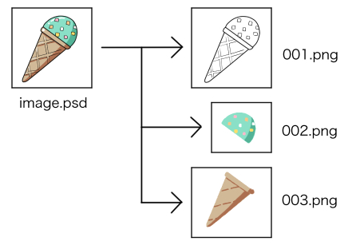

# split-layer-psd

Extracts each layers in psd file, and output them to image files.

This tool is based on [oov/psd: PSD/PSB(Photoshop) file reader for Go programming language](https://github.com/oov/psd).
 
## Install

~~~
go install github.com/egawata/split-layer-psd@latest
~~~

## Usage

~~~
split-layer-psd -f image.psd -o outdir
~~~

## Options

- `-f`: (*required*) psd filename
- `-o`: directory to save images. If omitted, the same directory with psd file is used.
- `-bgcolor=(color value)`: fill background with specified color.
    - color name: one of `black` `blue` `red` `magenta` `green` `cyan` `yellow` and `white`
    - hex color code: like `f3c791`
- `-bw`: fill background with white. shorthand for `-bgcolor=white`